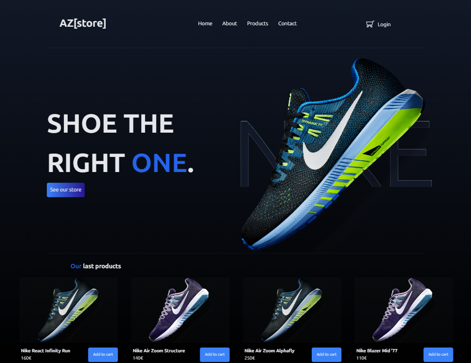

# AZstore

Ceci est un projet réalisé en groupe dans le cadre de mon apprentissage chez BeCode. Ce projet est vise à améliorer nos compétences en PHP.
Fontend Mentor est un site proposant des défis à réaliser pour s'améliorer en front-end.

## Table of contents

- [Overview](#overview)
  - [The challenge](#the-challenge)
  - [Screenshot](#screenshot)
- [My process](#my-process)
  - [Built with](#built-with)
- [Author](#author)
- [Acknowledgments](#acknowledgments)
- [Remarque](#remarque)

## Overview

Le contexte : 
Vous êtes développeur web pour une agence web et votre patron vous a demandé de créer un petit panier d'achat pour le site web d'un client. Le panier doit permettre d'ajouter et de supprimer des produits. Il doit également pouvoir afficher le prix total des produits qu'il contient.

### Le challenge

Les utilisateurs doivent être capables de

- Ajouter et supprimer des produits.
- Accéder à son panier
- Recevoir des messages de validation de formulaire si
  - un champ a été omis
  - l'adresse électronique n'est pas formatée correctement.

### Screenshot

## My process

### Built with

- PHP
- SCSS
- JavaScript Vanilla
- Flexbox
- Mobile-first workflow

## Author

- Github - [Dylan Feys](https://github.com/HappyFeys)

## Acknowledgments

Merci à mon groupe pour avoir mené a bien ce projet : 

- [Arnaud](https://github.com/javadaller)
- [Isabelle](https://github.com/isab95)

## Remarque

Pour un projet entièrement PHP, nous avons fait beaucoup de JavaScript 